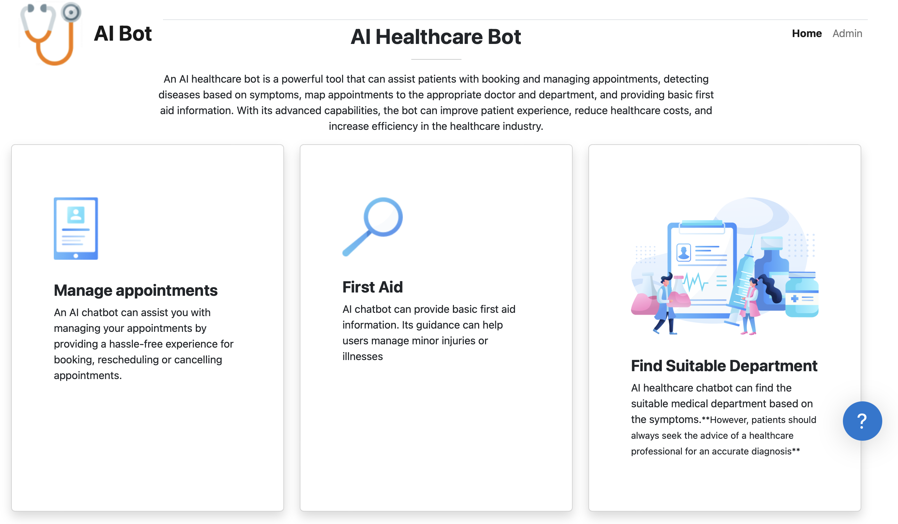

# AI chatbot for healthcare
An AI healthcare bot is a powerful tool that can assist patients with booking and managing appointments, detecting diseases based on symptoms, map appointments to the appropriate doctor and department, and providing basic first aid information. With its advanced capabilities, the bot can improve patient experience, reduce healthcare costs, and increase efficiency in the healthcare industry.
## About Model
An intent-based bidirectional LSTM model is used to build the model. It is a type of neural network architecture used in natural language processing (NLP) for intent classification. It uses a bidirectional long short-term memory (LSTM) network to capture the contextual information of a given sentence in both forward and backward directions.


## Architecture


### Chatbot Model Architecture 
```
Model: "sequential"
_________________________________________________________________
 Layer (type)                Output Shape              Param #   
=================================================================
 embedding (Embedding)       (None, None, 100)         33800     
                                                                 
 bidirectional (Bidirectiona  (None, 256)              234496    
 l)                                                              
                                                                 
 dense (Dense)               (None, 128)               32896     
                                                                 
 dropout (Dropout)           (None, 128)               0         
                                                                 
 dense_1 (Dense)             (None, 51)                6579      
                                                                 
=================================================================
Total params: 307,771
Trainable params: 307,771
Non-trainable params: 0
_________________________________________________________________
```


## Workflows 


## DEMO



#### Mail to User from bot 


## How to run the application
### Backend
To run the application, install all required dependencies and create SMTP API key for mail communication 

Build the docker image 
```
docker build -t ai-bot:1.0 .

```
Run docker image 
```
docker run -p 5001:5001 ai-bot:1.0

```

